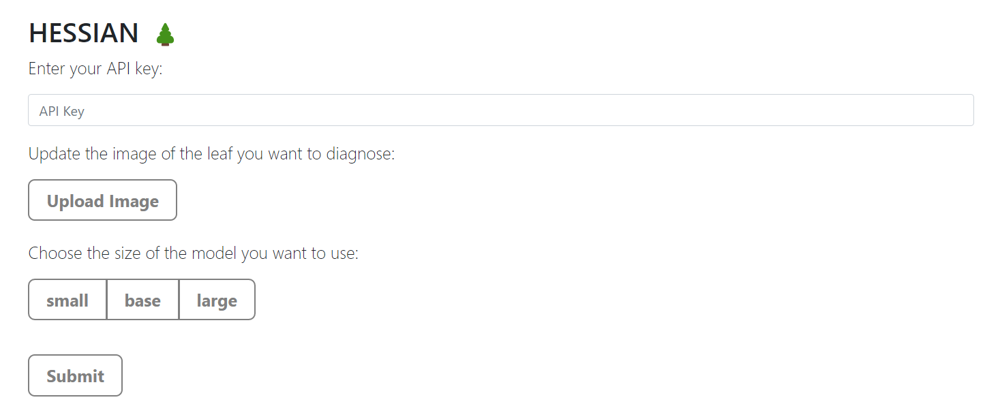
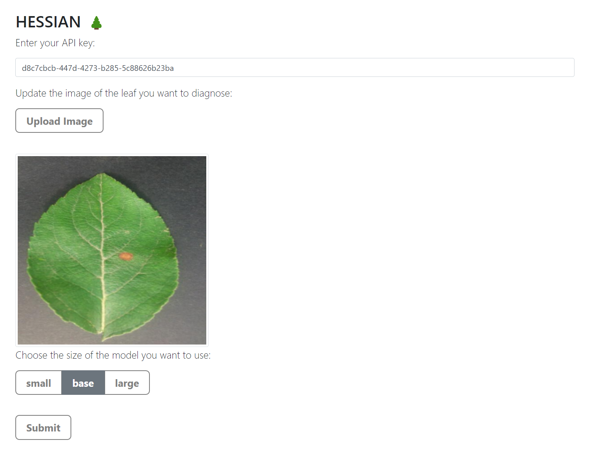
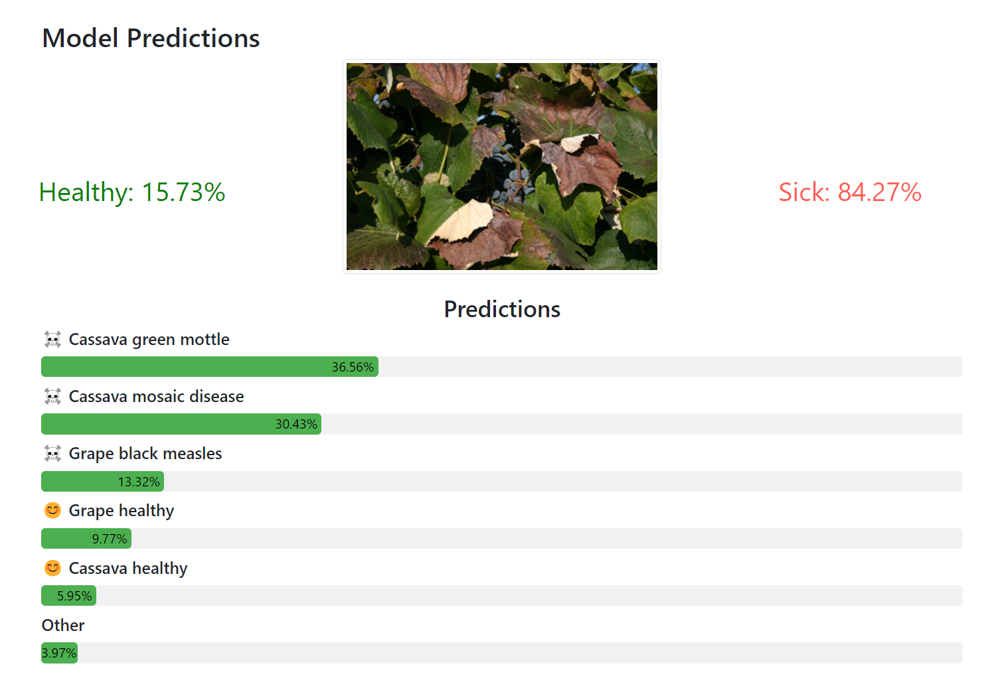

# API
This document provides a complete overview of what you can do with our API, as well as its interface. We dockerized our API and made it <a href="http://hessian.be">publicly available</a>! The source code of our API can be found in the `server.py` file.

## Deployment

### Docker
See `Dockerfile` for the dockerization of our API. The API docker is built using `build_docker.sh` and started using `start_dockerized_server.sh`.

### Cloud
We decided to host our API on a VPS and to make it publicly available, you can access the API interface on <a href="http://hessian.be">hessian.be</a>. The API can be queried directly through <a href="http://hessian.be/api">hessian.be/api</a> or <a href="http://hessian.be/api/billing">hessian.be/api/billing</a> depending on the type of request that the user wants to send.

## API Backend
The API can be queried with an HTTP payload. Specifically, the header of the request should contain the API key in the `HESSIAN-API-Key` field. According to the request, the parameters and the body of the request are different. The `query_api.py` file proposes ready-to-use functions to query our API.

### Inference Request
To perform inference on an image, the request should contain the model type as parameters in the `model` field. Additionnaly, the image encoded in base64 as a raw string should be sent in the body of the request:

```python
import requests
import base64

def query_hessian_api(api_key, image, model_name):

    response = requests.post(
        "http://hessian.be/api",
        headers={"HESSIAN-API-Key": api_key},
        params={"model": model_name},
        data=image # Encoded in base64
    )

    return response.json()

# Query the API
api_key = "d8c7cbcb-447d-4273-b285-5c88626b23be"

# Encode the image in base64
image = "https://agrio.app/wp-content/uploads/2019/11/image1-17.jpg"
image = base64.b64encode(requests.get(image).content).decode("utf-8")

model_size = "large"

response = query_hessian_api(api_key, image, model_size)
```

The output will be a JSON mapping a class to its probability:

```python
{'Apple___alternaria_leaf_spot': 1.1405738860048587e-06, 'Apple___black_rot': 2.2144778914999062e-18, 'Apple___brown_spot': 1.518613501616528e-08, 'Apple___gray_spot': 1.277254710885245e-07, 'Apple___healthy': 6.475198688349337e-07, 'Apple___rust': 6.812467290728819e-06, 'Apple___scab': 4.432162313605659e-06, 'Bell_pepper___bacterial_spot': 1.2819054733184613e-18, 'Bell_pepper___healthy': 1.1570750234614502e-20, ... }
```

### Billing Request
As a user of HESSIAN, you can use different models depending on your needs. The stronger the model, the more expensive it is. Our billing API can be queried to have a summary of all the requests you have made and the amount that you will be billed:

```python
import requests

def query_billing(api_key):

    response = requests.get(
        "http://hessian.be/api/billing",
        headers={"HESSIAN-API-Key": api_key}
    )

    return response.json()

# Query the API
api_key = "d8c7cbcb-447d-4273-b285-5c88626b23be"

billing = query_billing(api_key)
```
The result is a JSON summarizing your usage of HESSIAN for all models that you have used. All amounts are expressed in euros (€).

```python
{'models': {'base': {'count': 8, 'total': 0.32, 'unit_price': 0.04},
            'large': {'count': 16, 'total': 0.8, 'unit_price': 0.05},
            'small': {'count': 7, 'total': 0.14, 'unit_price': 0.02}},
 'total': 1.26}
 ```

### Database
We store requests made by our users, as well as all the models that are available. The database uses SQL and its implementation can be used in the `database/` and `storage/` subdirectories.

## Dashboard
In order to provide some insights about our API usage and health, we developed a dashboard for HESSIAN. Our dashboard is accessible at <a href="http://hessian.be/dashboard">http://hessian.be/dashboard</a> and contains:

- The hardware usage of our server (CPU and RAM)
- The API latency in MS
- The number of calls that the API received each day
- An overview of the usage of each model size

## API Frontend
We provide a convenient way to our users to interact with our API in a human-friendly manner. It is described in this section. The implementation of the frontend can be found in `templates/`.

### Home page
The following image shows the home page of <a href="http://hessian.be">hessian.be</a> where :
- You can put your API key which will help us ensure that you have access to the desired model to use.
- You can upload the image for which you want to have predictions.
- You can choose the desired model.



Finally, once the above is done, you can submit your request.


### Results page
After the submission, you will be redirected to the results page where you can see the resulting probabilities of the binary prediction, i.e., whether the leaf in the image is healthy or not, and you can also see a more advanced resulting probabilities for the 61 different classes.

