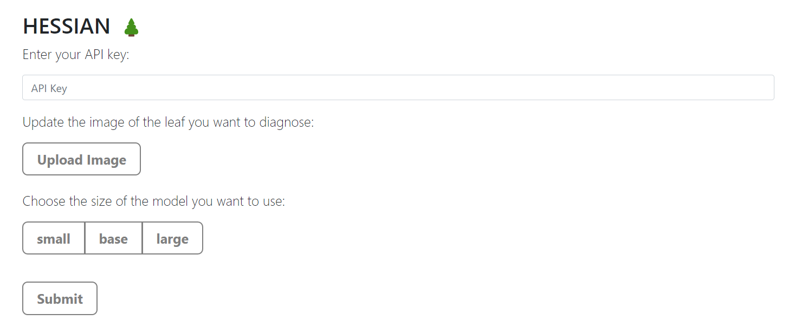
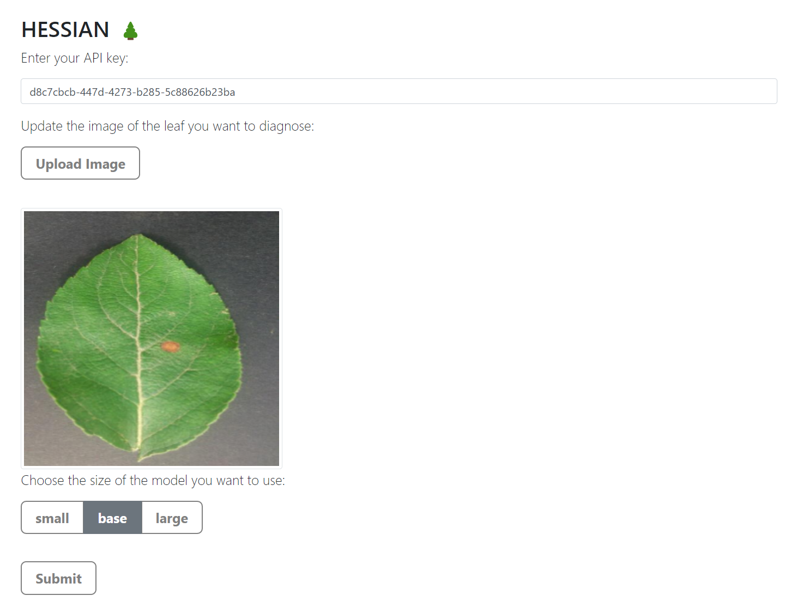
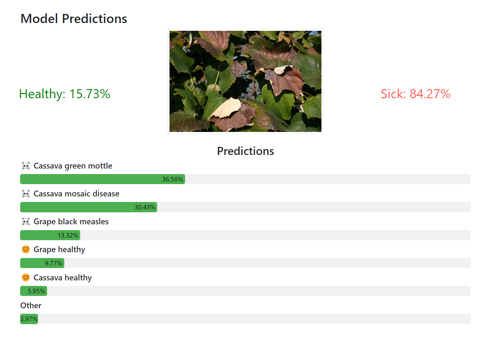

# API
This document provides a complete overview of what you can do with our API.

## API Backend
TODO

## Database
TODO

## API Frontend
We provide a convenient way to our users to interact with our API. It is described in this section.

### Home page
The following image shows the home page where :
- You can put your API key which will help us ensure that you have access to the desired model to use.
- You can upload the image for which you want to have predictions
- You can choose the desired model, again a valid API is needed !

Finally, once the above is done, you can submit your request.

### Results page
After the submission, you will be redirected to the results page where you can see the resulting probabilities of the binary prediction, i.e. whether the leaf in the image is healthy or not, and you can also see a more advanced resulting probabilities for the 61 different classes.

