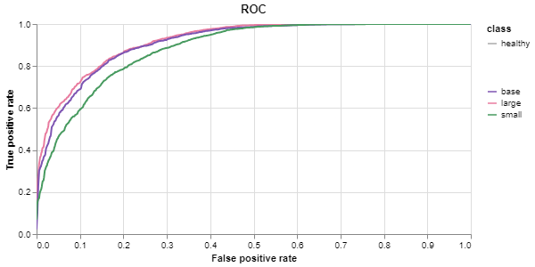

# Models

This document offers an overview of the model architectures we have utilized, along with the checkpoints for each. Every checkpoint is designed to meet varying computational demands and accuracy expectations.

## Training Monitoring

We used [Weights & Biases](https://wandb.ai/) to monitor our training sessions. A training report summarizing the training of all of our models is available here: https://api.wandb.ai/links/lba_mlops/qas5kiru.

## Architecture

All our models draw inspiration from the AlexNet architecture [[1]](#1). Their implementations are available in the `AlexNet.py` file. The training script that was used can be found in `train.py`. Finally, `inference.py` contains the code used to make predictions with our models.

## Available Checkpoints

All checkpoints can be found in the `checkpoints` subdirectory.

- **`small.pt`**: Contains the weights for the small-sized model variant. Ideal for environments with limited computational resources.
- **`base.pt`**: Contains the weights for the base-sized model variant. Offers a balance between performance and computational efficiency.
- **`large.pt`**: Contains the weights for the large-sized model variant. Best suited for scenarios where model performance is prioritized over computational cost.

## Model Performance Metrics

The performance of each model variant is evaluated based on two primary metrics:

- **Global Accuracy**: Reflects the overall accuracy of the model across all 61 classes included in the training dataset.
- **Binary Accuracy**: Measures the model's accuracy in distinguishing between healthy leaves and those affected by a disease.

### Performance Comparison Table

The following table presents a detailed comparison of the performance metrics across the different model variants:

| Model Variant        | Number of Parameters | Global Accuracy | Binary Accuracy |
|----------------------|----------------------|-----------------|-----------------|
| **Small**            | 134,709              | 71%             | 88%             |
| **Base**             | 526,957              | 73%             | 89%             |
| **Large**            | 2,076,365            | 76%             | 90%             |

## Receiver Operating Characteristic (ROC) Curve

The ROC curve below illustrates the trade-off between sensitivity and specificity for the different model variants. It provides insight into the diagnostic ability of the models at various threshold settings.

This graphical representation aids in the evaluation of model performance, particularly in binary classification tasks.

---

## References
<a id="1">[1]</a> 
Krizhevsky, Alex, Sutskever, Ilya, and Hinton, Geoffrey E. Imagenet classification with deep convolutional
neural networks. In Advances in neural information processing systems, pp. 1097–1105, 2012.