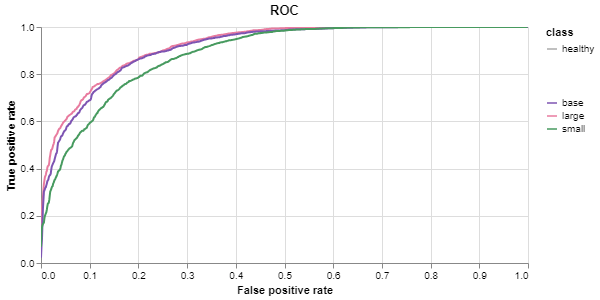

# Pre-trained Model Checkpoints Overview

This document provides an overview of the pre-trained model checkpoints available for use. Each checkpoint is tailored to different computational needs and accuracy requirements.

## Available Checkpoints

- **`small.pt`**: Contains the weights for the small-sized model variant. Ideal for environments with limited computational resources.
- **`base.pt`**: Contains the weights for the base-sized model variant. Offers a balance between performance and computational efficiency.
- **`large.pt`**: Contains the weights for the large-sized model variant. Best suited for scenarios where model performance is prioritized over computational cost.

## Model Performance Metrics

The performance of each model variant is evaluated based on two primary metrics:

- **Global Accuracy**: Reflects the overall accuracy of the model across all 61 classes included in the training dataset.
- **Binary Accuracy**: Measures the model's accuracy in distinguishing between healthy leaves and those affected by a disease.

### Performance Comparison Table

The following table presents a detailed comparison of the performance metrics across the different model variants:

| Model Variant        | Number of Parameters | Global Accuracy | Binary Accuracy |
|----------------------|----------------------|-----------------|-----------------|
| **Small**            | 134,709              | 71%             | 88%             |
| **Base**             | 526,957              | 73%             | 89%             |
| **Large**            | 2,076,365            | 76%             | 90%             |

## Receiver Operating Characteristic (ROC) Curve

The ROC curve below illustrates the trade-off between sensitivity and specificity for the different model variants. It provides insight into the diagnostic ability of the models at various threshold settings.

This graphical representation aids in the evaluation of model performance, particularly in binary classification tasks.

---

For further information or to access the model checkpoints, please refer to the project repository or contact the project maintainers.